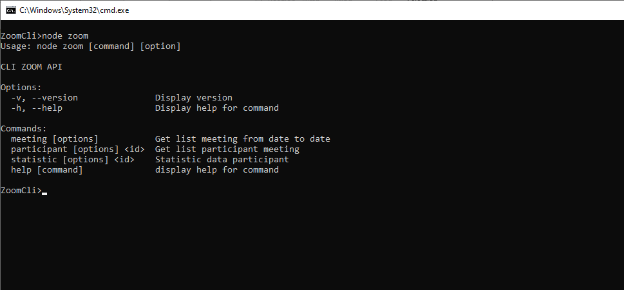

Để sử dụng API của Zoom chúng ta cần đăng ký tạo 1 ứng dụng với các bước sau:

Truy cập vào [App Marketplace (zoom.us)](https://marketplace.zoom.us/) và đăng nhập.

Tại màn hình trang chủ:

- Chọn "Develop" ở góc phải trên cùng.
- Chọn "Build App".
- Chọn "Server to Server OAuth App" và nhấn "Create".

Điền tên ứng dụng và nhấn "Create"

Bổ sung thêm các thông tin để hoàn thành:

Lưu ý: Tại bước chọn “Scopes” chúng ta cần chọn một số scope để có quyền sử dụng Api

Sau khi hoàn thành đăng ký ứng dụng, chúng ta có thể sử dụng các thông tin tại “App Credentials” lấy Access token gọi Api.

Url: <https://zoom.us/oauth/token>

Method: POST

Header: Chuỗi Authorization sau Basic được mã hóa Base64 <client\_id:client\_secret > với client\_id và client\_secret được cup cấp trong ‘’ App Credentials’’ khi tạo ứng dụng.

"Content-Type": "application/x-www-form-urlencoded"

`    	`"Authorization": "Basic HHHHH0000011111"

Body: JSON

{ "grant\_type": "account\_credentials", "account\_id": 1234}

Response example:

{

`      `"access\_token": "eyJhbGciOiJIUzUxMiIsInYiOiIyLjAiLCJraWQiOiI8S0lEPiJ9.eyJ2ZXIiOiI2IiwiY2xpZW50SWQiOiI8Q2xpZW50X0lEPiIsImNdGGUiOiI8Q29kZT4iLCJpc3MiOiJ1cm46em9vbTpjb25uZWN0OmNsaWVudGlkOjxDbGllbnRfSUQ-IiwiYXV0aGVudGljYXRpb25JZCI6IjxBdXRoZW50aWNhdGlvbl9JRD4iLCJ1c2VySWQiOiI8VXNlcl9JRD4iLCJnvn91cE51bWJlciI6MCwiYXVkIjoiaHR0cHM6Ly9vYXV0aC56b29tLnVzIiwiYWNjb3VudElkIjoiPEFjY291bnRfSUQ-IiwibmJmIjoxNTgwMTQ2OTkzLCJleHAiOjE1ODAxNTA1OTMsInRva2VuVHlwZSI6ImFjY2Vzc950b2tlbiIsImlhdCI6MTU4MDE0Njk5MywianRpIjoiPEpUST4iLCJ0b2xlcmFuY2VJZCI6MjV9.F9o\_w7\_lde4Jlmk\_tbpLlDc-6QGmVrCbe\_6El-xrZehnMx7qyoZPUzyuNAKUKcHfbdZa6Q4QBSvpd6eIFXvjHw",

`      `"token\_type": "bearer",

`      `"expires\_in": 3599,

`      `"scope" : "user:read:admin",

`      `"api\_url": "https://api.zoom.us"

}

**1. Api lấy danh sách các cuộc họp**

**GET:** https://api.zoom.us/v2/report/users/{userId}/meetings

Lấy danh sách các cuộc họp trong một khoảng thời gian cụ thể. Phạm vi thời gian được giới hạn trong một tháng và tháng đó phải nằm trong vòng 6 tháng trở lại đây. Các cuộc họp chỉ được trả về nếu có từ hai người tham gia trở lên

**HEADER:** 

- Authorization: Bearer <access\_token>

**PATH PARAMETERS:**

- userId: ID người dùng hoặc địa chỉ email của người dùng

**QUERY-STRING PARAMETERS:**

|from|Ví dụ: 2024-07-01|Ngày bắt đầu theo định dạng 'yyyy-mm-dd'. Phạm vi ngày được xác định bởi các tham số "From" và "To"|
| :- | :- | :- |
|to|Ví dụ: 2024-07-30|Ngày kết thúc|
|page\_size|
Giá trị mặc định: 30

Giá trị tối đa: 300

Ví dụ: 30
|Số lượng bản ghi trả về khi gọi API.|
|next\_page\_token|Ví dụ: AfJX3jsOLW7dgzvxc|Sử dụng lấy kết quả trang kế tiếp khi kết quả trả về vượt quá kích thước trang hiện tại.|
|type|
Giá trị mặc định: past

Các giá trị cho phép: past, pastOne, pastJoined 
|
- ` `past: Tất cả các cuộc họp đã mở.

- pastOne: Trả về cuộc họp gần nhất của người dùng.

- pastJoined: Trả về tất cả các cuộc họp người dùng là chủ trì hoặc là người tham gia

|

**VÍ DỤ:** 

**GET:** https://api.zoom.us/v2/report/users/lanhathoang244@gmail.com/meetings?&type=past&page\_size=300&from=2024-06-27&to=2024-07-30

` `**Response**:

{

`    `"from": "2024-06-30",

`    `"to": "2024-07-30",

`    `"page\_count": 1,

`    `"page\_size": 300,

`    `"total\_records": 4,

`    `"next\_page\_token": "",

`    `"meetings": [

`        `{

`            `"uuid": "ncsN4SUnSAqZdZSqyw2F4A==",

`            `"id": 86967908343,

`            `"host\_id": "Pj2PW8z5RfqBhYSTO3Fcww",

`            `"type": 2,

`            `"topic": "Thực tập tốt nghiệp",

`            `"user\_name": "Nhật Hoàng",

`            `"user\_email": "lanhathoang244@gmail.com",

`            `"start\_time": "2024-07-28T08:36:26Z",

`            `"end\_time": "2024-07-28T09:13:14Z",

`            `"duration": 37,

`            `"total\_minutes": 65,

`            `"participants\_count": 5,

`            `"source": "Zoom"

`        `}

`    `]

}

**2. Api lấy thông tin người tham gia cuộc họp**

**GET**: /report/meetings/{meetingId}/participants

Trả về danh sách thông tin các người tham gia, bao gồm cả người chủ trì phòng. 

**HEADER:** 

- Authorization: Bearer <access\_token>

**PATH PARAMETERS:**

- meetingId: ID cuộc họp hoặc ID duy nhất (UUID). Nếu sử dụng ID cuộc họp, API sẽ trả về danh sách của phiên họp mới nhất. Nếu sử dụng UUID cuộc họp bắt đầu bằng ký tự / hoặc chứa các ký tự //, phải mã hóa 2 lần UUID cuộc họp bằng URL encode trước khi thực hiện gọi API.

**QUERY-STRING PARAMETERS:**

|page\_size|
Giá trị mặc định: 30

Giá trị tối đa: 300

Ví dụ: 30
|Số lượng bản ghi trả về khi gọi API.|
| :- | :- | :- |
|next\_page\_token|Ví dụ: AfJX3jsOLW7dgzvxc|Sử dụng lấy kết quả trang kế tiếp khi kết quả trả về vượt quá kích thước trang hiện tại.|

**VÍ DỤ:** 

**GET:** https://api.zoom.us/v2/report/meetings/86967908343/participants?page\_size=30

` `**Response**:

{

`    `"page\_count": 1,

`    `"page\_size": 30,

`    `"total\_records": 5,

`    `"next\_page\_token": "",

`    `"participants": [

`        `{

`            `"id": "Pj2PW8z5RfqBhYSTO3Fcww",

`            `"user\_id": "16778240",

`            `"name": "Nhật Hoàng",

`            `"user\_email": "lanhathoang244@gmail.com",

`            `"join\_time": "2024-07-28T08:36:26Z",

`            `"leave\_time": "2024-07-28T08:41:00Z",

`            `"duration": 274,

`            `"attentiveness\_score": "",

`            `"bo\_mtg\_id": "",

`            `"failover": false,

`            `"status": "in\_meeting",

`            `"groupId": "",

`            `"customer\_key": "",

`            `"participant\_user\_id": "Pj2PW8z5RfqBhYSTO3Fcww"

`        `},

`    `]

}

**3. Thống kê dữ liệu người dùng**

Để thống kê dữ liệu người tham gia cuộc họp trong Zoom, sẽ sử dụng API để lấy danh sách người tham gia cuộc họp và sau đó xử lý dữ liệu để lọc ra những người tham gia duy nhất bằng cách nhóm tên người dùng và email.

Trong ví dụ hình ảnh dưới là danh sách thông tin người tham gia cuộc họp

Thông tin người sử dụng sau khi được lọc và tính tổng thời gian tham gia

**4. Thực hiện**

Các Api được tích hợp dưới dạng cli để có thể dễ sử dụng.

Sử dụng câu lệnh “node zoom” để xem danh sách các command

Để xem cụ thể Argument và Option của command, sử dụng câu lệnh “node zoom <Command> --help” 

Ví dụ: node zoom participant --help

**Lấy danh sách các cuộc họp đã mở:** “node zoom meeting”

Có thể truyền thêm các option:

Ví dụ: node zoom meeting --from 2024-07-01  --to 2024-08-01

Có thể rút ngắn gọn các Option --from, --to bằng -f, -t

Ví dụ: node zoom meeting -f 2024-07-01  -t 2024-08-01

Tương ứng với Api lấy danh sách các cuộc họp đã mở từ ngày 01/07/2024 đến ngày 01/08/2024

**Lấy danh sách thông tin người tham gia:** “node zoom participant `<ID>`”

Tham số `<ID>` yêu cầu bắt buộc có thể truyền vào ID hoặc UUID của cuộc họp trong danh sách cuộc họp ở trên

Ví dụ: node zoom participant 86967908343

**Thống kê người tham gia:** “node zoom statistic `<ID>`”

Tham số `<ID>` yêu cầu bắt buộc có thể truyền vào ID hoặc UUID của cuộc họp

Ví dụ: node zoom statistic 86967908343

**5. Đóng gói mã nguồn**

**Cài đặt pkg:** “npm install -g pkg”

**Đóng gói ứng dụng:** “npm run build”

**Lưu ý:** Có thể đóng gói ứng dụng bằng cách chỉ định cụ thể hệ điều hành và kiến trúc

**Ví dụ:** “pkg -t node18-linux-x64, node18-macos-x64,node18-win-x64 .”
